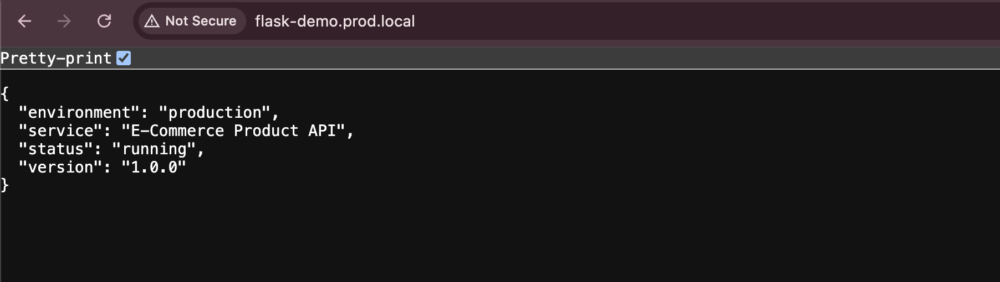

# End-to-End CI/CD Pipeline with GitOps

A complete CI/CD pipeline using **Jenkins**, **Docker**, **Nexus**, **ArgoCD**, **Helm**, and **Kubernetes** to automate building, testing, and deploying a Flask-based E-Commerce Product API.

## Project Overview

This project consists of two repositories:

| Repository | Purpose |
|---|---|
| [`devops-cicd-pipeline`](https://github.com/pouyaarjomandi/devops-cicd-pipeline) | Application source code + Jenkinsfile + Dockerfile |
| [`gitops`](https://github.com/pouyaarjomandi/gitops) | Helm charts + ArgoCD application manifests + environment-specific values |

## Architecture

```
Developer pushes code
        ↓
  Jenkins Pipeline
  ┌──────────────────────────┐
  │ 1. Checkout              │
  │ 2. Install Dependencies  │
  │ 3. Run Unit Tests        │
  │ 4. Build Docker Image    │
  │ 5. Push Image to Nexus   │
  │ 6. Update GitOps Repo    │
  └──────────┬───────────────┘
             ↓
   GitOps Repo (image tag updated)
             ↓
   ArgoCD detects change
             ↓
   Kubernetes deployment auto-synced
```

## Repository Structure

```
devops-cicd-pipeline/
├── app.py                    # Flask API application
├── Dockerfile                # Multi-stage Docker build
├── Jenkinsfile               # CI/CD pipeline definition
├── requirements.txt          # Production dependencies
├── requirements-dev.txt      # Dev/test dependencies
├── pytest.ini                # Pytest configuration
├── tests/
│   ├── conftest.py           # Test fixtures
│   └── test_app.py           # Unit tests (8 tests)
└── infrastructures/
    ├── docker-compose.yml    # Jenkins + DinD + Nexus stack
    └── jenkins/
        └── Dockerfile        # Custom Jenkins image with Docker CLI & Python
```

## Pipeline Stages

1. **Checkout** — Clone source code
2. **Install Dependencies** — Create virtualenv, install packages
3. **Run Unit Tests** — Execute pytest with JUnit XML report
4. **Build Docker Image** — Multi-stage build with non-root user
5. **Push Image to Nexus** — Push to private Nexus Docker registry (branches: `develop`, `staging`, `main`)
6. **Update GitOps Repo** — Update image tag in the corresponding environment values file

## Multi-Branch Strategy

| Branch | Environment | GitOps Values File |
|--------|-------------|-------------------|
| `develop` | Development | `apps/dev/values.yaml` |
| `staging` | Staging | `apps/staging/values.yaml` |
| `main` | Production | `apps/prod/values.yaml` |
|
| API Endpoints

| Method | Endpoint | Description |
|--------|----------|-------------|
| `GET` | `/` | Service info |
| `GET` | `/health` | Liveness probe |
| `GET` | `/ready` | Readiness probe |
| `GET` | `/api/products` | List all products |
| `GET` | `/api/products/<id>` | Get product by ID |
| `POST` | `/api/products` | Create new product |

## Quick Start — Infrastructure

```bash
cd infrastructures
docker compose up -d
```

This starts:
- **Jenkins** on `localhost:8080`
- **Nexus** on `localhost:8081` (Docker registry on port `8083`)
- **Docker-in-Docker** for building images inside Jenkins

## Running Tests Locally

```bash
python3 -m venv .venv
source .venv/bin/activate
pip install -r requirements-dev.txt
pytest
```

## Demo

### Jenkins Pipeline — develop branch


### Jenkins Pipeline — staging branch


### Jenkins Pipeline — main branch


### Nexus Docker Registry


### ArgoCD — All Applications


### Kubernetes Pods


### API — Products Endpoint


### API — Home Endpoint


## Tools & Technologies

Jenkins · Docker · Kubernetes · ArgoCD · Helm · Nexus · Python · Flask · Gunicorn · pytest

## Author

**Pouya Arjmandiakram** — [GitHub](https://github.com/pouyaarjomandi) · [LinkedIn](https://www.linkedin.com/in/pouya-arjomandi/)